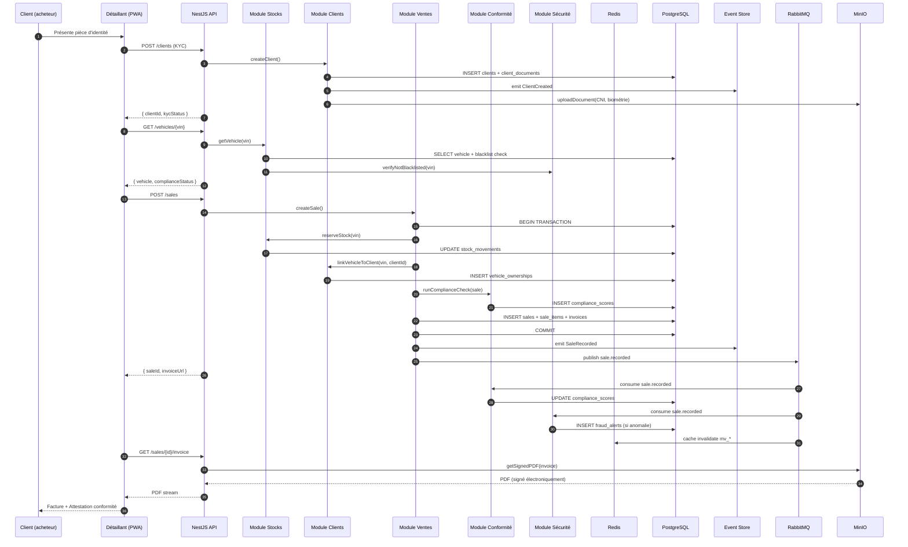
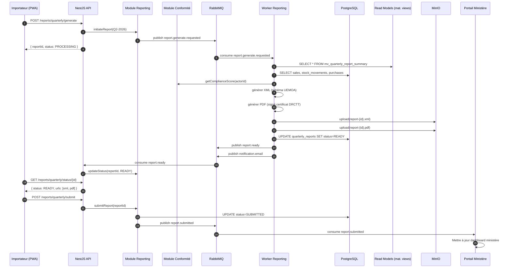
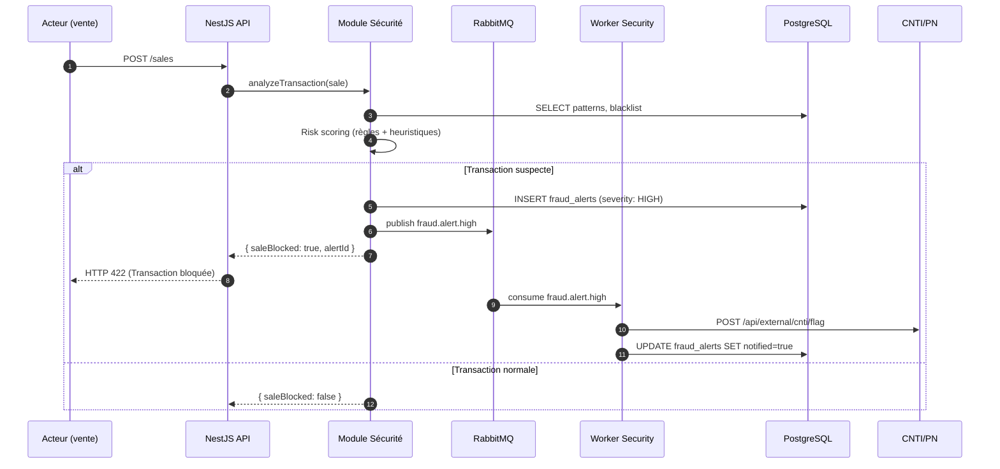

# iReg Moto BF — Spécification Technique Globale

> **Plateforme réglementaire SaaS pour la conformité des deux-roues motorisés au Burkina Faso**
> Arrêté ministériel 05/06/2026 — Direction de la Reglementation et du Controle des Transports Terrestres (DRCTT)
> Version: 1.0.0 | Statut: Brouillon d'architecture | Date: 2025-06-10

---

## Table des matières

1. [Vue d'ensemble](#1-vue-densemble)
2. [Architecture C4](#2-architecture-c4)
3. [Patterns architecturaux](#3-patterns-architecturaux)
4. [Architecture modulaire](#4-architecture-modulaire)
5. [Flux de données](#5-flux-de-données)
6. [Stratégie de cache et performance](#6-stratégie-de-cache-et-performance)
7. [Stratégie offline-first et synchronisation](#7-stratégie-offline-first-et-synchronisation)
8. [Sécurité](#8-sécurité)
9. [Interopérabilité](#9-interopérabilité)
10. [Multi-devises et fiscalité](#10-multi-devises-et-fiscalité)
11. [Cartographie et géofencing](#11-cartographie-et-géofencing)
12. [Monitoring et observabilité](#12-monitoring-et-observabilité)
13. [Déploiement et infrastructure](#13-déploiement-et-infrastructure)
14. [Glossaire](#14-glossaire)

---

## 1. Vue d'ensemble

### 1.1 Contexte métier

Le Burkina Faso impose, par arrêté ministériel 05/06/2026, de nouvelles conditions strictes aux acteurs de la chaîne de valeur des deux-roues motorisés (importateurs, distributeurs, unités d'assemblage, détaillants). La plateforme **iReg Moto BF** constitue le canal numérique unique de conformité réglementaire, interconnectant les acteurs économiques, les contrôleurs du ministère et les forces de sécurité.

### 1.2 Objectifs qualité (ISO 25010)

| Caractéristique | Cible | Stratégie |
|----------------|-------|-----------|
| Disponibilité | 99.9% (SLA) | Clustering K8s, replication PostgreSQL, Redis Sentinel |
| Performance | p95 < 200ms (API) | Cache multi-niveaux, indexation, CQRS read-model |
| Sécurité | Niveau eIDAS « substantiel » | JWT+OAuth2+MFA, chiffrement AES-256, audit trail immuable |
| Maintenabilité | Temps moyen de réparation < 4h | Modularité stricte, tests > 80%, documentation vivante |
| Scalabilité | 10 000 utilisateurs simultanés | Horizontal pod autoscaling, partitionnement, read replicas |
| Compatibilité | Chrome 90+, Android 8+, iOS 14+ | PWA, API REST/GraphQL, i18n 4 langues |
| Résilience offline | 72h de continuité métier | PWA offline-first, sync différée, IndexedDB |

### 1.3 Acteurs et périmètres

| Acteur | Rôle | Modules utilisés |
|--------|------|-----------------|
| Importateur/Distributeur | Déclaration import, stock, ventes, rapports | A, B, C, D, E, F |
| Unité d'assemblage | Gestion production, conformité, traçabilité | A, B, C, D, E, F |
| Détaillant | Vente au détail, KYC client, liaison engin | C, D, F |
| Contrôleur ministère | Inspection, agrément, sanction | H, F |
| Administrateur DRCTT | Vue nationale, analytics, configuration | H |
| Agent CNTI/PN | Signalement sécurité, blacklist, enquête | G, H |
| Système DGI (futur) | Interopérabilité fiscale | D, E (API) |
| Système Police nationale (futur) | Vérification VIN, interop sécurité | G, H (API) |

### 1.4 Stack technique validée

| Couche | Technologie | Version | Justification |
|--------|------------|---------|---------------|
| **Frontend** | React + TypeScript | 18.x | Ecosystème mature, PWA natif |
| | Tailwind CSS | 3.x | Styling utility-first, bundle léger |
| | Shadcn/ui | latest | Composants accessibles, personnalisables |
| | Workbox | 7.x | Service Worker, cache strategies |
| **Backend** | NestJS (Node.js) | 10.x | Pattern décorateurs, DI natif, modularité |
| | GraphQL (Apollo) | 4.x | Typage fort, queries flexibles |
| | TypeORM | 0.3.x | Migrations, relations, PostgreSQL driver |
| **Base de données** | PostgreSQL | 15.x | JSONB, partitionnement, Row Level Security |
| | Redis | 7.x | Cache, sessions, rate limiting, Pub/Sub |
| **Message Broker** | RabbitMQ | 3.12+ | Routing flexible, dead-letter, federation |
| **Stockage objet** | MinIO | latest | S3-compatible, on-premise possible |
| **Conteneurisation** | Docker + Kubernetes | 1.28+ | Cloud-agnostic, scaling horizontal |
| **Reverse Proxy** | Traefik | 3.x | Ingress natif K8s, Let's Encrypt auto |
| **Monitoring** | Prometheus + Grafana | latest | Métriques temps réel, alerting |
| **Logs** | Loki + Grafana | latest | Centralisation logs, corrélation |
| **Tracing** | Jaeger | latest | Distributed tracing OpenTelemetry |

---

## 2. Architecture C4

### 2.1 Niveau 1 — Contexte Système (System Context)

```
┌─────────────────────────────────────────────────────────────────────────────┐
│                              iReg Moto BF                                    │
│                     Plateforme Réglementaire 2R-Moto BF                      │
│                                                                              │
│  ┌──────────────┐  ┌──────────────┐  ┌──────────────┐  ┌──────────────┐   │
│  │Importateurs/ │  │  Unités d'   │  │  Détaillants │  │ Contrôleurs  │   │
│  │Distributeurs │  │  assemblage  │  │              │  │   DRCTT      │   │
│  └──────┬───────┘  └──────┬───────┘  └──────┬───────┘  └──────┬───────┘   │
│         │                 │                 │                 │            │
│    [Web PWA]          [Web PWA]        [Web/Mobile PWA]   [App Mobile]    │
│         │                 │                 │                 │            │
│         └─────────────────┴─────────────────┘                 │            │
│                           │                                   │            │
│                           ▼                                   ▼            │
│              ┌────────────────────────┐    ┌─────────────────────┐         │
│              │   iReg Moto BF SaaS    │    │  Portail Admin Web  │         │
│              │   (React + NestJS)     │    │  (Analytics, BI)    │         │
│              └───────────┬────────────┘    └─────────────────────┘         │
│                          │                                                  │
└──────────────────────────┼──────────────────────────────────────────────────┘
                           │
              ┌────────────┼────────────┬────────────┬────────────┐
              ▼            ▼            ▼            ▼            ▼
       ┌──────────┐ ┌──────────┐ ┌──────────┐ ┌──────────┐ ┌──────────┐
       │PostgreSQL│ │  Redis   │ │ RabbitMQ │ │  MinIO   │ │   SMTP   │
       │   15+    │ │   7+     │ │  3.12+   │ │  (S3)    │ │/SMS API  │
       └──────────┘ └──────────┘ └──────────┘ └──────────┘ └──────────┘

External Systems (futur):
┌──────────┐  ┌──────────┐  ┌──────────┐  ┌──────────┐  ┌──────────┐
│   DGI    │  │  Police  │  │   UEMOA  │  │  Token   │  │   CNSS   │
│   API    │  │ Nationale│  │   API    │  │ Service  │  │   API    │
└──────────┘  └──────────┘  └──────────┘  └──────────┘  └──────────┘
```

### 2.2 Niveau 2 — Conteneurs (Containers)

```
┌──────────────────────────────────────────────────────────────────────────────┐
│                         iReg Moto BF — Conteneurs                             │
├──────────────────────────────────────────────────────────────────────────────┤
│                                                                              │
│  ┌─────────────────────────────────────────────────────────────────────┐    │
│  │                        API GATEWAY (Traefik)                         │    │
│  │   - Rate limiting (Redis)                                            │    │
│  │   - SSL termination (Let's Encrypt)                                  │    │
│  │   - Routing /api/* → NestJS | /graphql → Apollo                      │    │
│  │   - WAF basique, IP filtering                                        │    │
│  └─────────────┬──────────────────────────────────┬────────────────────┘    │
│                │                                  │                         │
│  ┌─────────────▼──────────────┐    ┌──────────────▼─────────────┐          │
│  │     NESTJS API (Core)      │    │    NESTJS WORKERS          │          │
│  │    ┌────────────────┐      │    │  ┌──────────────────────┐  │          │
│  │    │ Module Auth    │      │    │  │ Worker Reporting     │  │          │
│  │    │ (JWT/OAuth2)   │      │    │  │ (génération PDF/XML) │  │          │
│  │    ├────────────────┤      │    │  ├──────────────────────┤  │          │
│  │    │ Module Acteurs │      │    │  │ Worker Notifications │  │          │
│  │    │ (MODULE A)     │      │    │  │ (email, SMS, push)   │  │          │
│  │    ├────────────────┤      │    │  ├──────────────────────┤  │          │
│  │    │ Module Stocks  │      │    │  │ Worker Analytics     │  │          │
│  │    │ (MODULE B)     │      │    │  │ (agrégations, KPI)   │  │          │
│  │    ├────────────────┤      │    │  ├──────────────────────┤  │          │
│  │    │ Module Clients │      │    │  │ Worker Compliance    │  │          │
│  │    │ (MODULE C)     │      │    │  │ (calcul score auto)  │  │          │
│  │    ├────────────────┤      │    │  ├──────────────────────┤  │          │
│  │    │ Module Ventes  │      │    │  │ Worker Security      │  │          │
│  │    │ (MODULE D)     │      │    │  │ (détection fraude)   │  │          │
│  │    ├────────────────┤      │    │  └──────────────────────┘  │          │
│  │    │ Module Rapports│      │    └──────────────────────────┘          │
│  │    │ (MODULE E)     │      │                                          │
│  │    ├────────────────┤      │                                          │
│  │    │ Module Conform.│      │                                          │
│  │    │ (MODULE F)     │      │                                          │
│  │    ├────────────────┤      │                                          │
│  │    │ Module Sécurité│      │                                          │
│  │    │ (MODULE G)     │      │                                          │
│  │    ├────────────────┤      │                                          │
│  │    │ Module Admin   │      │                                          │
│  │    │ (MODULE H)     │      │                                          │
│  │    └────────────────┘      │                                          │
│  │         TypeORM              │                                          │
│  │    ┌────────────────┐      │                                          │
│  │    │ Event Store    │◄─────┼──────────────────────────────────────────┤
│  │    │ (PostgreSQL)   │      │                                          │
│  │    └────────────────┘      │                                          │
│  └─────────────┬──────────────┘                                          │
│                │                                                          │
│  ┌─────────────▼──────────────┐    ┌──────────────┐    ┌──────────────┐  │
│  │   REACT PWA (Frontend)    │    │   PostgreSQL  │    │    Redis     │  │
│  │  ┌────────────────────┐   │    │   (Primary +  │    │   (Cluster)  │  │
│  │  │ Workbox SW         │   │    │    2 Replicas)│    │              │  │
│  │  │ IndexedDB (local)  │   │    │   Partitionné │    │  - Sessions  │  │
│  │  │ Background Sync    │   │    │   - 40+ tables│    │  - Cache     │  │
│  │  │ i18n (fr/mos/dyula)│   │    │   - RLS       │    │  - Rate Limit│  │
│  │  └────────────────────┘   │    └──────────────┘    └──────────────┘  │
│  └──────────────────────────┘                                            │
│                                                                              │
│  ┌──────────────────────────┐    ┌──────────────┐    ┌──────────────┐     │
│  │   MinIO (Object Store)   │    │  RabbitMQ    │    │  Prometheus  │     │
│  │   - Documents KYC        │    │  - Exchanges │    │  + Grafana   │     │
│  │   - Photos engins        │    │  - Queues    │    │  + Loki      │     │
│  │   - Rapports PDF/XML     │    │  - DLX       │    │  + Jaeger    │     │
│  │   - Pièces d'identité    │    │  - Federation│    │              │     │
│  └──────────────────────────┘    └──────────────┘    └──────────────┘     │
│                                                                              │
└──────────────────────────────────────────────────────────────────────────────┘
```

### 2.3 Niveau 3 — Composants Core (Modules NestJS)

```
┌────────────────────────────────────────────────────────────────┐
│              NESTJS CORE — Détail des Modules                   │
├────────────────────────────────────────────────────────────────┤
│                                                                │
│  ┌─────────────────────────────────────────────────────────┐  │
│  │              SHARED KERNEL (NestJS Core)                 │  │
│  │  ┌──────────┐ ┌──────────┐ ┌──────────┐ ┌───────────┐  │  │
│  │  │Database  │ │  Redis   │ │ Event    │ │  Logger   │  │  │
│  │  │Module    │ │Module    │ │Bus (Rabbit│ │ (Pino)   │  │  │
│  │  │(TypeORM) │ │(ioredis) │ │MQ Client)│ │          │  │  │
│  │  └──────────┘ └──────────┘ └──────────┘ └───────────┘  │  │
│  │  ┌──────────┐ ┌──────────┐ ┌──────────┐ ┌───────────┐  │  │
│  │  │MinIO     │ │Config    │ │Exception │ │  Health   │  │  │
│  │  │Service   │ │Module    │ │Filter    │ │  Check    │  │  │
│  │  └──────────┘ └──────────┘ └──────────┘ └───────────┘  │  │
│  └─────────────────────────────────────────────────────────┘  │
│                                                                │
│  ┌─────────────────────────────────────────────────────────┐  │
│  │              CROSS-CUTTING CONCERNS                      │  │
│  │  ┌──────────┐ ┌──────────┐ ┌──────────┐ ┌───────────┐  │  │
│  │  │Guards    │ │Intercept.│ │Pipes     │ │Middleware │  │  │
│  │  │(Authz)   │ │(Logging, │ │(Validat. │ │(Corr. ID, │  │  │
│  │  │          │ │ Transf.) │ │ Transform)│ │Locale)   │  │  │
│  │  └──────────┘ └──────────┘ └──────────┘ └───────────┘  │  │
│  │  ┌──────────┐ ┌──────────┐ ┌──────────┐ ┌───────────┐  │  │
│  │  │Throttler │ │i18n      │ │Webhook   │ │  Audit    │  │  │
│  │  │(Rate Lim)│ │Module    │ │Service   │ │  Interceptor  │  │
│  │  └──────────┘ └──────────┘ └──────────┘ └───────────┘  │  │
│  └─────────────────────────────────────────────────────────┘  │
│                                                                │
│  ┌──────────┐  ┌──────────┐  ┌──────────┐  ┌──────────┐      │
│  │ MODULE A │  │ MODULE B │  │ MODULE C │  │ MODULE D │      │
│  │ Acteurs  │  │ Stocks   │  │ Clients  │  │ Ventes   │      │
│  │ Controller│  │ Controller│  │ Controller│  │ Controller│     │
│  │ Service   │  │ Service   │  │ Service   │  │ Service   │     │
│  │ Repository│  │ Repository│  │ Repository│  │ Repository│     │
│  │ Events    │  │ Events    │  │ Events    │  │ Events    │     │
│  │ Sagas     │  │ Sagas     │  │ Sagas     │  │ Sagas     │     │
│  └──────────┘  └──────────┘  └──────────┘  └──────────┘      │
│                                                                │
│  ┌──────────┐  ┌──────────┐  ┌──────────┐  ┌──────────┐      │
│  │ MODULE E │  │ MODULE F │  │ MODULE G │  │ MODULE H │      │
│  │ Rapports │  │Conformité│  │ Sécurité │  │  Admin   │      │
│  │ Controller│  │ Controller│  │ Controller│  │ Controller│     │
│  │ Service   │  │ Service   │  │ Service   │  │ Service   │     │
│  │ Repository│  │ Repository│  │ Repository│  │ Repository│     │
│  │ Events    │  │ Rules     │  │ ML (futur)│  │ Analytics │     │
│  │ Generator │  │ Engine    │  │ Detection │  │ Dashboard │     │
│  └──────────┘  └──────────┘  └──────────┘  └──────────┘      │
│                                                                │
└────────────────────────────────────────────────────────────────┘
```

---

## 3. Patterns architecturaux

### 3.1 API Gateway Pattern

```
Client → Traefik Ingress → [Auth Middleware] → [Rate Limiter] → [Router]
                                               (Redis)           │
                                                                 ▼
                              ┌──────────────────────────────────┬──────────────────┐
                              │                                  │                  │
                              ▼                                  ▼                  ▼
                        /api/v1/* REST                     /graphql             /ministry/*
                              │                          (Apollo Server)       (Module H)
                              ▼                                  │                  │
                    NestJS Controllers                   Resolvers NestJS      NestJS Guards
                    (Modules A-G)                        (Auth: API Key)       (Role: MINISTRY)
```

**Responsabilités Gateway :**
- SSL termination et renouvellement automatique (Let's Encrypt)
- Rate limiting par IP et par utilisateur (bucket algorithm, Redis backend)
- Routing contextuel : `/api/v1/` → REST, `/graphql` → GraphQL, `/ministry/` → portail admin
- Authentification préliminaire (validation JWT, extraction claims)
- CORS configuration par environnement
- Request/Response transformation (compression gzip/brotli)
- Circuit breaker vers services externes (DGI, Police)

### 3.2 CQRS (Command Query Responsibility Segregation)

**Application :** Modules D (Reporting) et E (Rapportage trimestriel) et H (Analytics)

```
┌─────────────────────────────────────────────────────────────────────────┐
│                            CQRS PATTERN                                  │
├─────────────────────────────────────────────────────────────────────────┤
│                                                                          │
│   WRITE SIDE                          READ SIDE                          │
│   ┌──────────────┐                   ┌──────────────┐                   │
│   │   Command    │                   │    Query     │                   │
│   │   (NestJS)   │                   │   (NestJS)   │                   │
│   └──────┬───────┘                   └──────┬───────┘                   │
│          │                                  │                           │
│          ▼                                  ▼                           │
│   ┌──────────────┐                   ┌──────────────┐                   │
│   │Command Bus   │                   │  Query Bus   │                   │
│   │(RabbitMQ)    │                   │  (Direct)    │                   │
│   └──────┬───────┘                   └──────┬───────┘                   │
│          │                                  │                           │
│          ▼                                  ▼                           │
│   ┌──────────────┐                   ┌──────────────┐                   │
│   │ Command      │                   │  Read Model  │                   │
│   │ Handlers     │                   │  Projections │                   │
│   │ (Validation  │                   │  (Materialized│                  │
│   │  Business    │                   │   Views)       │                  │
│   │  Rules)      │                   │                │                  │
│   └──────┬───────┘                   └──────┬───────┘                   │
│          │                                  │                           │
│          ▼                                  ▼                           │
│   ┌──────────────┐                   ┌──────────────┐                   │
│   │  Event Store │ ──Event Bus────► │  PostgreSQL  │                   │
│   │  (events     │   (RabbitMQ)     │  Read Replicas│                  │
│   │   table)     │                   │  (dénormalisés)│                  │
│   └──────────────┘                   └──────────────┘                   │
│          │                                                             │
│          ▼                                                             │
│   ┌──────────────┐                                                   │
│   │ Domain Events │  ──Projections──► Redis Cache (hot queries)       │
│   │ (Saga handlers)│                                                  │
│   └──────────────┘                                                   │
│                                                                          │
│   EVENTS: ActorCreated, VehicleImported, SaleRecorded,                 │
│           ComplianceCheckFailed, ClientKYCCompleted, ...               │
└─────────────────────────────────────────────────────────────────────────┘
```

**Read Models matérialisés :**
| Vue | Source Events | Refresh | Usage |
|-----|-------------|---------|-------|
| `mv_quarterly_report_summary` | SaleRecorded, StockMovement | Temps réel (event handler) | MODULE E |
| `mv_actor_compliance_score` | ComplianceChecked, ActorUpdated | Temps réel | MODULE F, H |
| `mv_national_stock_overview` | VehicleImported, VehicleSold | Toutes les 5 min | MODULE H |
| `mv_sales_analytics` | SaleRecorded, PricingUpdated | Temps réel | MODULE D, H |
| `mv_fraud_risk_index` | FraudAlertTriggered, PatternDetected | Temps réel | MODULE G |

### 3.3 Event Sourcing — Audit Trail Immuable

**Application :** Toutes les actions métier critiques (création acteur, vente, modification conformité, signalement sécurité)

```
┌─────────────────────────────────────────────────────────────────────────┐
│                         EVENT SOURCING                                   │
├─────────────────────────────────────────────────────────────────────────┤
│                                                                          │
│   Entité : Véhicule (agrégat)                                            │
│                                                                          │
│   Event Stream (table domain_events) :                                   │
│   ┌──────────┬─────────────┬──────────────┬──────────────────────────┐  │
│   │ event_id │ aggregate_id│ event_type   │ payload (JSONB)          │  │
│   ├──────────┼─────────────┼──────────────┼──────────────────────────┤  │
│   │  uuid-1  │ VIN-XXX     │VehicleCreated│{"vin":"...","category":A}│  │
│   │  uuid-2  │ VIN-XXX     │StockReceived │{"warehouse":"W01","qty":1}│  │
│   │  uuid-3  │ VIN-XXX     │VehicleSold   │{"client_id":"C123",...}  │  │
│   │  uuid-4  │ VIN-XXX     │OwnershipTrans│{"new_owner":"C456",...}  │
│   │  uuid-5  │ VIN-XXX     │ComplianceChk │{"result":"PASS",...}     │  │
│   └──────────┴─────────────┴──────────────┴──────────────────────────┘  │
│                                                                          │
│   Reconstruction état actuel :                                           │
│   foldl(apply_event, initial_state, sorted_events) → État courant       │
│                                                                          │
│   Signature cryptographique (chaînage) :                                 │
│   signature = SHA256(event_payload + previous_signature + timestamp)    │
│                                                                          │
│   Tables impactées :                                                     │
│   - domain_events (stream principal, partitionné par mois)               │
│   - domain_event_snapshots (snapshot quotidien pour reconstruction rapide)│
│   - event_projections (projections dénormalisées pour lectures)          │
│                                                                          │
└─────────────────────────────────────────────────────────────────────────┘
```

**Séquence de chaînage :**
```
Event N: { payload, prev_hash: Hash(N-1), timestamp } → Hash(N) = SHA256(payload + prev_hash + timestamp)

Vérification intégrité: pour chaque événement, recalculer Hash(N) et comparer au hash stocké.
Toute modification détectée → Alert sécurité + flag base.
```

### 3.4 Saga Pattern — Orchestration des processus métier

**Saga « Processus de vente d'un véhicule » :**
```
┌──────────┐   ┌──────────┐   ┌──────────┐   ┌──────────┐   ┌──────────┐
│  STEP 1  │──►│  STEP 2  │──►│  STEP 3  │──►│  STEP 4  │──►│  STEP 5  │
│ Vérifier │   │ Vérifier │   │ Enregistr│   │ Mettre à │   │ Générer  │
│ blacklist│   │conformité│   │ vente    │   │ jour stock│   │ facture  │
└──────────┘   └──────────┘   └──────────┘   └──────────┘   └──────────┘
     │              │              │              │              │
     ▼              ▼              ▼              ▼              ▼
  [PASS/FAIL]   [PASS/FAIL]   [OK/ERREUR]   [OK/ERREUR]   [OK/ERREUR]
     │              │              │              │              │
     └──────────────┴──────────────┴──────────────┴──────────────┘
                                   │
                    ┌──────────────▼──────────────┐
                    │  Compensation (rollback)    │
                    │  - Annuler vente            │
                    │  - Restaurer stock          │
                    │  - Logger échec             │
                    └─────────────────────────────┘
```

---

## 4. Architecture modulaire

### 4.1 Décision : Modulaire monolithique (Modular Monolith)

**Recommandation :** Architecture modulaire monolithique avec séparation physique des bounded contexts.

**Justification (détaillée dans ADR-002) :**

| Critère | Microservices | Modular Monolith | Gagnant |
|---------|--------------|------------------|---------|
| Complexité opérationnelle | Élevée (K8s complexe, service mesh) | Modérée (1 déploiement, modules isolés) | **Modular** |
| Latence inter-module | Réseau (ms) | Mémoire (µs) | **Modular** |
| Cohérence transactionnelle | Saga distribuée complexe | ACID natif par module | **Modular** |
| Résilience offline (Afrique) | Complexe (circuit breakers partout) | Simple (1 conteneur, base locale possible) | **Modular** |
| Bande passante | Consommateur (JSON sur HTTP) | Économique (appels mémoire) | **Modular** |
| Équipe (démarrage) | 3+ équipes nécessaires | 1-2 équipes suffisantes | **Modular** |
| Scalabilité indépendante | Excellente | Possible via workers séparés | Microservices |
| Time-to-market | 6+ mois | 3-4 mois MVP | **Modular** |

**Stratégie d'évolution :**
```
Phase 1 (MVP, 0-6 mois) : Modular Monolith complet
Phase 2 (6-12 mois) : Extraction Module G (Sécurité) si volume critique
Phase 3 (12-18 mois) : Extraction Module E (Reporting) si charge sévère
Phase 4 (18-24 mois) : Extraction Module H (Admin) si indépendance requise
```

### 4.2 Structure des modules

```
src/
├── main.ts                          # Point d'entrée NestJS
├── app.module.ts                    # Module racine (imports tous les modules)
│
├── config/                          # Configuration centralisée
│   ├── database.config.ts
│   ├── redis.config.ts
│   ├── minio.config.ts
│   ├── rabbitmq.config.ts
│   └── security.config.ts
│
├── shared/                          # Kernel partagé (pas de dépendance métier)
│   ├── decorators/
│   ├── guards/
│   ├── interceptors/
│   ├── filters/
│   ├── pipes/
│   ├── interfaces/
│   ├── enums/
│   ├── utils/
│   └── services/
│       ├── cache.service.ts
│       ├── storage.service.ts
│       ├── event-publisher.service.ts
│       ├── audit.service.ts
│       └── notification.service.ts
│
├── modules/
│   ├── auth/                        # Authentification & autorisation
│   │   ├── auth.module.ts
│   │   ├── auth.controller.ts
│   │   ├── auth.service.ts
│   │   ├── strategies/
│   │   │   ├── jwt.strategy.ts
│   │   │   ├── oauth2.strategy.ts
│   │   │   └── mfa.strategy.ts
│   │   ├── guards/
│   │   │   ├── jwt-auth.guard.ts
│   │   │   ├── roles.guard.ts
│   │   │   └── permissions.guard.ts
│   │   └── entities/
│   │       ├── user.entity.ts
│   │       ├── role.entity.ts
│   │       ├── permission.entity.ts
│   │       └── mfa-setting.entity.ts
│   │
│   ├── actors/                      # MODULE A — Acteurs Économiques
│   │   ├── actors.module.ts
│   │   ├── actors.controller.ts
│   │   ├── actors.service.ts
│   │   ├── actors.repository.ts
│   │   ├── entities/
│   │   │   ├── actor.entity.ts
│   │   │   ├── actor-type.entity.ts
│   │   │   ├── actor-document.entity.ts
│   │   │   ├── warehouse.entity.ts
│   │   │   └── agreement.entity.ts
│   │   ├── dto/
│   │   ├── events/
│   │   └── sagas/
│   │
│   ├── stocks/                      # MODULE B — Stocks et Inventaire
│   │   ├── stocks.module.ts
│   │   ├── stocks.controller.ts
│   │   ├── stocks.service.ts
│   │   ├── entities/
│   │   │   ├── vehicle.entity.ts
│   │   │   ├── vehicle-category.entity.ts
│   │   │   ├── vehicle-blacklist.entity.ts
│   │   │   ├── stock-movement.entity.ts
│   │   │   └── inventory-count.entity.ts
│   │   └── ...
│   │
│   ├── clients/                     # MODULE C — Clients et Traçabilité
│   │   ├── clients.module.ts
│   │   ├── clients.controller.ts
│   │   ├── clients.service.ts
│   │   ├── entities/
│   │   │   ├── client.entity.ts
│   │   │   ├── client-document.entity.ts
│   │   │   ├── vehicle-ownership.entity.ts
│   │   │   └── biometric-data.entity.ts
│   │   └── ...
│   │
│   ├── sales/                       # MODULE D — Ventes et Pricing
│   │   ├── sales.module.ts
│   │   ├── sales.controller.ts
│   │   ├── sales.service.ts
│   │   ├── entities/
│   │   │   ├── sale.entity.ts
│   │   │   ├── sale-item.entity.ts
│   │   │   ├── purchase-price.entity.ts
│   │   │   ├── pricing-history.entity.ts
│   │   │   ├── invoice.entity.ts
│   │   │   └── tax-configuration.entity.ts
│   │   └── ...
│   │
│   ├── reporting/                   # MODULE E — Rapportage Trimestriel
│   │   ├── reporting.module.ts
│   │   ├── reporting.controller.ts
│   │   ├── reporting.service.ts
│   │   ├── entities/
│   │   │   ├── quarterly-report.entity.ts
│   │   │   └── report-submission.entity.ts
│   │   ├── generators/
│   │   │   ├── xml.generator.ts
│   │   │   └── pdf.generator.ts
│   │   └── ...
│   │
│   ├── compliance/                  # MODULE F — Conformité
│   │   ├── compliance.module.ts
│   │   ├── compliance.controller.ts
│   │   ├── compliance.service.ts
│   │   ├── entities/
│   │   │   ├── compliance-rule.entity.ts
│   │   │   ├── compliance-checklist.entity.ts
│   │   │   └── compliance-score.entity.ts
│   │   ├── engine/
│   │   │   ├── rule-engine.service.ts
│   │   │   └── scoring.service.ts
│   │   └── ...
│   │
│   ├── security/                    # MODULE G — Sécurité / Fraude
│   │   ├── security.module.ts
│   │   ├── security.controller.ts
│   │   ├── security.service.ts
│   │   ├── entities/
│   │   │   ├── fraud-alert.entity.ts
│   │   │   ├── security-blacklist.entity.ts
│   │   │   └── transaction-flag.entity.ts
│   │   └── ...
│   │
│   └── admin/                       # MODULE H — Portail Administratif
│       ├── admin.module.ts
│       ├── admin.controller.ts
│       ├── admin.service.ts
│       ├── entities/
│       │   ├── geofence-zone.entity.ts
│       │   ├── notification-template.entity.ts
│       │   ├── webhook-endpoint.entity.ts
│       │   └── api-key.entity.ts
│       └── ...
│
└── workers/                         # Workers asynchrones (déploiement séparé)
    ├── reporting.worker.ts
    ├── notification.worker.ts
    ├── analytics.worker.ts
    ├── compliance.worker.ts
    └── security.worker.ts
```

---

## 5. Flux de données

### 5.1 Flux principal — Processus de vente (end-to-end)



### 5.2 Flux — Rapportage trimestriel



### 5.3 Flux — Détection fraude et sécurité



---

## 6. Stratégie de cache et performance

### 6.1 Architecture de cache multi-niveaux

```
┌─────────────────────────────────────────────────────────────────────────┐
│                        CACHE STRATEGY                                    │
├─────────────────────────────────────────────────────────────────────────┤
│                                                                          │
│  NIVEAU 1 — Client (PWA)                                                │
│  ┌──────────────┐  Cache-Control: max-age=3600 pour données statiques   │
│  │ Workbox SW   │  IndexedDB pour données métier offline                 │
│  │ (Browser)    │  Stale-while-revalidate pour listes de référence      │
│  └──────────────┘                                                         │
│         │                                                                │
│  NIVEAU 2 — CDN (futur)                                                 │
│  ┌──────────────┐  Assets statiques (images, documents publics)         │
│  │ CloudFront/  │                                                         │
│  │ CloudFlare   │                                                         │
│  └──────────────┘                                                         │
│         │                                                                │
│  NIVEAU 3 — Reverse Proxy                                               │
│  ┌──────────────┐  Rate limiting bucket (Redis)                          │
│  │ Traefik      │  SSL session cache                                     │
│  │              │                                                         │
│  └──────────────┘                                                         │
│         │                                                                │
│  NIVEAU 4 — Application Cache (Redis Cluster)                           │
│  ┌──────────────┐  ┌──────────────────────────────────────────────┐     │
│  │ Redis        │  │  Keys Pattern            │ TTL      │ Usage    │     │
│  │              │  ├──────────────────────────────────────────────┤     │
│  │  - Sessions  │  │  session:{userId}        │ 24h      │ Auth     │     │
│  │  - Cache     │  │  cache:actors:{id}       │ 5min     │ Acteur   │     │
│  │  - Pub/Sub   │  │  cache:vehicle:{vin}     │ 10min    │ Véhicule │     │
│  │  - Locks     │  │  cache:stock:{warehouse} │ 2min     │ Stock    │     │
│  │  - Rate Lim. │  │  cache:pricing:{id}      │ 1min     │ Prix     │     │
│  │              │  │  cache:compliance:{id}   │ 5min     │ Score    │     │
│  │              │  │  cache:national:overview │ 1min     │ Admin    │     │
│  │              │  │  rate_limit:{ip}         │ 1min     │ Throttle │     │
│  │              │  │  mfa:attempts:{userId}   │ 15min    │ MFA      │     │
│  │              │  │  lock:stock:{vin}        │ 30s      │ Cuncurr. │     │
│  └──────────────┘  └──────────────────────────────────────────────┘     │
│                                                                          │
│  NIVEAU 5 — Database Cache                                              │
│  ┌──────────────┐  PostgreSQL shared_buffers = 25% RAM                  │
│  │ PostgreSQL   │  Effective cache size = 50% RAM                       │
│  │              │  Materialized views pour agrégations fréquentes       │
│  └──────────────┘                                                         │
│                                                                          │
│  INVALIDATION : Event-driven via RabbitMQ                               │
│  Tout événement métier → publish cache.invalidate.{entity}.{id}         │
│  Cache subscribers écoutent et invalident les clés correspondantes       │
└─────────────────────────────────────────────────────────────────────────┘
```

### 6.2 Optimisations PostgreSQL

```sql
-- Read replicas pour lectures analytiques
-- Connection pooling via PgBouncer (transaction mode)
-- Autovacuum tuning pour tables à fort turnover
-- BRIN indexes pour tables partitionnées (stock_movements, audit_logs)
-- B-tree indexes pour lookups par ID/VIN/NIF
-- GIN indexes pour recherches JSONB (metadata, payload events)
-- Partial indexes pour requêtes filtrées fréquentes (WHERE status = 'ACTIVE')
```

---

## 7. Stratégie offline-first et synchronisation

### 7.1 Architecture offline-first

```
┌─────────────────────────────────────────────────────────────────────────┐
│                      OFFLINE-FIRST ARCHITECTURE                          │
├─────────────────────────────────────────────────────────────────────────┤
│                                                                          │
│  ┌─────────────────────────────────────────────────────────────────┐    │
│  │                    PWA (Navigateur/ mobile)                      │    │
│  │                                                                  │    │
│  │  ┌──────────────┐  ┌──────────────┐  ┌──────────────────────┐  │    │
│  │  │ React App    │  │ Service      │  │ IndexedDB (Dexie.js) │  │    │
│  │  │ (UI + State  │◄─┤ Worker       │◄─┤                      │  │    │
│  │  │  Management) │  │ (Workbox)    │  │  - actors_local      │  │    │
│  │  └──────────────┘  └──────┬───────┘  │  - clients_local     │  │    │
│  │                           │          │  - sales_local       │  │    │
│  │                           │          │  - vehicles_local    │  │    │
│  │                           │          │  - stock_local       │  │    │
│  │                           │          │  - queue_sync        │  │    │
│  │                           │          │  - documents_local   │  │    │
│  │                           │          │                      │  │    │
│  │                           │          │  Schéma versionné    │  │    │
│  │                           │          │  (migrations DB)     │  │    │
│  │                           │          └──────────────────────┘  │    │
│  │                           │                                     │    │
│  │              ┌────────────┼────────────┐                      │    │
│  │              ▼            ▼            ▼                      │    │
│  │         ┌────────┐  ┌──────────┐  ┌───────────┐              │    │
│  │         │Cache   │  │Background│  │  Periodic │              │    │
│  │         │Strat.  │  │Sync API  │  │  Sync     │              │    │
│  │         │        │  │          │  │  (5 min)  │              │    │
│  │         └────────┘  └──────────┘  └───────────┘              │    │
│  │                                                               │    │
│  └───────────────────────────────────────────────────────────────┘    │
│                              │                                         │
│                    ┌─────────┴─────────┐                               │
│                    ▼                   ▼                               │
│              [ONLINE]            [OFFLINE]                             │
│                    │                   │                               │
│                    ▼                   ▼                               │
│         ┌──────────────┐    ┌─────────────────────┐                   │
│         │ API REST     │    │ Queue locale (FIFO)  │                   │
│         │ Sync bidirectionnelle    │  - Opérations en attente          │
│         │ (delta sync) │    │  - Timestamp UTC     │                   │
│         │ Conflict     │    │  - User context      │                   │
│         │ Resolution   │    │  - Retry count       │                   │
│         └──────────────┘    └─────────────────────┘                   │
│                                                                          │
└─────────────────────────────────────────────────────────────────────────┘
```

### 7.2 Mécanisme de synchronisation

**Protocole de synchronisation (delta sync) :**

```typescript
interface SyncRequest {
  clientLastSyncTimestamp: string;  // ISO 8601
  changes: LocalChange[];           // Modifications locales depuis lastSync
  deviceId: string;                 // Identifiant device (UUID stable)
}

interface LocalChange {
  operation: 'CREATE' | 'UPDATE' | 'DELETE';
  entity: 'actor' | 'client' | 'sale' | 'vehicle' | 'stock_movement';
  localId: string;                  // UUID généré localement
  serverId?: string;                // UUID serveur (si déjà sync)
  payload: Record<string, unknown>;
  checksum: string;                 // SHA256 du payload pour détection conflit
  timestamp: string;                // Horodatage local (UTC)
}

interface SyncResponse {
  serverTimestamp: string;
  applied: AppliedChange[];
  rejected: RejectedChange[];
  serverChanges: ServerChange[];    // Modifications serveur depuis lastSync
  conflicts: Conflict[];
}
```

**Résolution de conflits (Last-Write-Wins avec règles métier) :**

| Entité | Stratégie | Règle métier |
|--------|-----------|--------------|
| Acteur | Timestamp + Hiérarchie | Modification ministère > Importateur |
| Client | Timestamp | Dernier écrasant |
| Vente | Rejet + notification | Jamais de merge — alerte manuelle |
| Stock | CQRS (événements) | Merge via event sourcing |
| Véhicule | Verrou serveur | Modification serveur gagne toujours |

**Stratégie de réconciliation :**
```
1. Client envoie ses changements locaux + lastSyncTimestamp
2. Serveur récupère tous les changements serveur depuis lastSyncTimestamp
3. Pour chaque changement client :
   a. Vérifier conflit (même entité modifiée côté serveur depuis lastSync)
   b. Si conflit → appliquer règle métier + enregistrer dans conflict_log
   c. Si pas de conflit → appliquer + retourner confirmation
4. Serveur retourne : changements serveur + résultats client + conflits
5. Client met à jour sa base locale (applique changements serveur)
6. Client affiche les conflits à l'utilisateur pour résolution manuelle
```

### 7.3 Gestion des documents en mode offline

```
1. Photo prise (ex: CNI client) → stockage IndexedDB (blob)
2. Document marqué "pending_upload"
3. En mode offline : document reste local, accessible en lecture
4. Connexion restaurée :
   a. Upload document vers MinIO (multipart pour fichiers > 5MB)
   b. Mise à jour URL dans la base locale
   c. Notification utilisateur de confirmation
5. Si échec upload → retry exponentiel (5 min, 15 min, 1h, 4h)
```

### 7.4 PWA — Service Worker Strategy Matrix

| Ressource | Stratégie Workbox | Justification |
|-----------|------------------|---------------|
| HTML shell | NetworkFirst | Toujours frais, fallback offline |
| JS/CSS bundles | StaleWhileRevalidate | Performance + mises à jour en fond |
| API /actors, /vehicles | NetworkFirst with cache fallback | Données métier critiques |
| API /clients (recherche) | StaleWhileRevalidate | Recherche rapide, refresh en fond |
| Images (photos) | CacheFirst + expiration 7j | Assets lourds, rarement modifiés |
| Documents PDF | CacheFirst + expiration 30j | Rapports, factures |
| API mutations (POST) | BackgroundSync | File d'attente offline |

---

## 8. Sécurité

### 8.1 Architecture de sécurité en couches

```
┌─────────────────────────────────────────────────────────────────────────┐
│                         SECURITY LAYERS                                  │
├─────────────────────────────────────────────────────────────────────────┤
│                                                                          │
│  COUCHE 1 — Périmètre (Perimeter)                                       │
│  ┌──────────────┐ ┌──────────────┐ ┌──────────────┐                    │
│  │ WAF (Traefik)│ │ Rate Limiting│ │ IP Whitelist │                    │
│  │ (règles OWASP│ │ (Redis bucket│ │ (Admin)      │                    │
│  │  Core)       │ │  algorithm)  │ │              │                    │
│  └──────────────┘ └──────────────┘ └──────────────┘                    │
│                                                                          │
│  COUCHE 2 — Transport                                                   │
│  ┌──────────────┐ ┌──────────────┐                                     │
│  │ TLS 1.3      │ │ Certificate  │                                     │
│  │ (obligatoire)│ │ Pinning (app)│                                     │
│  └──────────────┘ └──────────────┘                                     │
│                                                                          │
│  COUCHE 3 — Authentification                                            │
│  ┌──────────────┐ ┌──────────────┐ ┌──────────────┐                    │
│  │ JWT (RS256)  │ │ OAuth2       │ │ MFA (TOTP/   │                    │
│  │ Access 15min │ │ (Google, MS) │ │  SMS)        │                    │
│  │ Refresh 7j   │ │              │ │ Admin: oblig.│                    │
│  └──────────────┘ └──────────────┘ └──────────────┘                    │
│                                                                          │
│  COUCHE 4 — Autorisation (RBAC + ABAC)                                 │
│  ┌──────────────┐ ┌──────────────┐ ┌──────────────┐                    │
│  │ Roles        │ │ Permissions  │ │ Ownership    │                    │
│  │ (DB)         │ │ (granulaires)│ │ (ressource)  │                    │
│  │              │ │              │ │              │                    │
│  │ IMPORTATEUR  │ │ actor:create │ │ actor:{id}   │                    │
│  │ DISTRIBUTEUR │ │ actor:read   │ │ sale:{id}    │                    │
│  │ DETAILLANT   │ │ actor:update │ │ client:{id}  │                    │
│  │ CONTROLEUR   │ │ sale:create  │ │              │                    │
│  │ ADMIN        │ │ report:submit│ │              │                    │
│  │ SUPER_ADMIN  │ │ admin:*      │ │              │                    │
│  └──────────────┘ └──────────────┘ └──────────────┘                    │
│                                                                          │
│  COUCHE 5 — Application                                                 │
│  ┌──────────────┐ ┌──────────────┐ ┌──────────────┐                    │
│  │ Input        │ │ Output       │ │ SQL Injection│                    │
│  │ Validation   │ │ Encoding     │ │ Protection   │                    │
│  │ (class-       │ │ (XSS prev.)  │ │ (param.      │                    │
│  │  validator)  │ │              │ │  queries)    │                    │
│  └──────────────┘ └──────────────┘ └──────────────┘                    │
│                                                                          │
│  COUCHE 6 — Données                                                     │
│  ┌──────────────┐ ┌──────────────┐ ┌──────────────┐                    │
│  │ Encryption   │ │ Row Level    │ │ Audit Trail  │                    │
│  │ at Rest (AES)│ │ Security     │ │ (Event       │                    │
│  │              │ │ (PostgreSQL) │ │  Sourcing)   │                    │
│  └──────────────┘ └──────────────┘ └──────────────┘                    │
│                                                                          │
│  COUCHE 7 — Monitoring                                                  │
│  ┌──────────────┐ ┌──────────────┐ ┌──────────────┐                    │
│  │ Alertes      │ │ SIEM (futur) │ │ Forensics    │                    │
│  │ (Grafana)    │ │              │ │ (logs signés)│                    │
│  └──────────────┘ └──────────────┘ └──────────────┘                    │
└─────────────────────────────────────────────────────────────────────────┘
```

### 8.2 Row Level Security (PostgreSQL)

```sql
-- Exemple RLS : Un importateur ne voit que SES ventes
ALTER TABLE sales ENABLE ROW LEVEL SECURITY;

CREATE POLICY sales_owner_isolation ON sales
    USING (actor_id = current_setting('app.current_actor_id')::UUID);

-- Les administrateurs voient tout
CREATE POLICY sales_admin_access ON sales
    FOR ALL
    TO admin_role
    USING (true);
```

---

## 9. Interopérabilité

### 9.1 Connecteurs futurs

```
┌─────────────────────────────────────────────────────────────────────────┐
│                    FUTURE INTEGRATIONS                                   │
├─────────────────────────────────────────────────────────────────────────┤
│                                                                          │
│  ┌──────────────┐              ┌──────────────┐                         │
│  │    DGI       │              │Police Nationale│                        │
│  │  (Burkina)   │              │   (Burkina)    │                        │
│  │              │              │                │                        │
│  │ API REST     │              │ API REST       │                        │
│  │ - NIF verify │              │ - VIN check    │                        │
│  │ - Tax status │              │ - Stolen check │                        │
│  │ - E-facture  │              │ - Owner verify │                        │
│  │              │              │ - Warrant check│                        │
│  └──────┬───────┘              └──────┬───────┘                        │
│         │                             │                                 │
│         └─────────────┬───────────────┘                                 │
│                       ▼                                                │
│           ┌─────────────────────┐                                      │
│           │  ADAPTER PATTERN    │                                      │
│           │                     │                                      │
│           │  ┌───────────────┐  │  ┌───────────────┐                  │
│           │  │ DGI Adapter   │  │  │ PN Adapter    │                  │
│           │  │ - auth        │  │  │ - auth        │                  │
│           │  │ - map request │  │  │ - map request │                  │
│           │  │ - map response│  │  │ - map response│                  │
│           │  │ - circuit     │  │  │ - circuit     │                  │
│           │  │   breaker     │  │  │   breaker     │                  │
│           │  │ - retry       │  │  │ - retry       │                  │
│           │  │ - cache       │  │  │ - cache       │                  │
│           │  └───────────────┘  │  └───────────────┘                  │
│           │                     │                                      │
│           │  ┌───────────────┐  │                                      │
│           │  │ UEMOA Adapter │  │  (Taux de change, normes)           │
│           │  └───────────────┘  │                                      │
│           └─────────────────────┘                                      │
│                       │                                                │
│                       ▼                                                │
│              ┌─────────────────┐                                       │
│              │  iReg Moto BF   │                                       │
│              │   (NestJS)      │                                       │
│              └─────────────────┘                                       │
│                                                                          │
│  Circuit Breaker Config :                                                │
│  - failureThreshold: 5 erreurs consécutives                             │
│  - recoveryTimeout: 60 secondes                                         │
│  - fallback: cache dernière valeur connue / valeur par défaut           │
│                                                                          │
└─────────────────────────────────────────────────────────────────────────┘
```

### 9.2 Webhook system

```typescript
// Configuration webhooks pour notifications externes
interface WebhookConfig {
  id: string;
  actorId: string;
  url: string;
  events: ('sale.recorded' | 'compliance.changed' | 'fraud.alert' | 'report.submitted')[];
  secret: string;           // HMAC-SHA256 signature
  active: boolean;
  retryPolicy: {
    maxRetries: number;     // default: 3
    backoffMs: number;      // default: 1000
  };
}
```

---

## 10. Multi-devises et fiscalité

### 10.1 Architecture multi-devises

```
┌─────────────────────────────────────────────────────────────────────────┐
│                    MULTI-CURRENCY & TAX ENGINE                           │
├─────────────────────────────────────────────────────────────────────────┤
│                                                                          │
│  DEVISES SUPPORTÉES :                                                    │
│  ┌──────────┬──────────┬──────────┬──────────────────────────────┐      │
│  │ Code     │ Nom      │ Décimales │ Source taux                  │      │
│  ├──────────┼──────────┼──────────┼──────────────────────────────┤      │
│  │ XOF      │ FCFA     │ 0        │ Devise de référence (fixe 1) │      │
│  │ EUR      │ Euro     │ 2        │ BCEAO (taux fixe ou flottant)│      │
│  │ USD      │ Dollar   │ 2        │ BCEAO + marge                │      │
│  │ NGN      │ Naira    │ 2        │ Marché parallèle             │      │
│  │ GHS      │ Cedi     │ 2        │ BCEAO                        │      │
│  │ XAF      │ FCFA BEAC│ 0        │ BCEAO                        │      │
│  └──────────┴──────────┴──────────┴──────────────────────────────┘      │
│                                                                          │
│  TABLE currency_rates :                                                  │
│  - from_currency, to_currency, rate, effective_date, source              │
│  - Index unique sur (from, to, date) pour historique                     │
│  - Taux mis à jour quotidiennement via API BCEAO                         │
│                                                                          │
│  CONVERSION AUTOMATIQUE :                                                │
│  - Tous les prix stockés en XOF (référence)                             │
│  - Conversion à l'affichage selon préférence utilisateur                 │
│  - Arrondi : règle mathématique standard, 0 décimales pour XOF          │
│                                                                          │
│  CALCUL DES PRIX :                                                       │
│  purchase_price_XOF = foreign_price * exchange_rate + import_fees        │
│  selling_price_XOF = purchase_price_XOF * (1 + margin_rate) + taxes      │
│                                                                          │
└─────────────────────────────────────────────────────────────────────────┘
```

### 10.2 Moteur fiscal OHADA/UEMOA

| Taxe | Code | Taux | Application | Calcul |
|------|------|------|-------------|--------|
| Droit de Douane (DD) | UEMOA-DD | 0-35% | Importation | Valeur CIF × taux |
| Taxe sur la Valeur Ajoutée (TVA) | UEMOA-TVA | 18% | Vente | Prix HT × 18% |
| Droit d'Accise et de Consommation (DUS) | UEMOA-DUS | Variable | Véhicules > 50cc | Spécifique par cylindrée |
| Redevance (RED) | UEMOA-RED | Fixe | Immatriculation | Montant forfaitaire |
| Taxe OHADA Prélèvement | OHADA-PRE | 2% | CA importateurs | Chiffre d'affaires × 2% |

```typescript
interface TaxCalculation {
  baseAmount: number;           // Montant de base (XOF)
  taxBreakdown: {
    taxCode: string;
    taxLabel: string;
    rate: number;
    amount: number;
  }[];
  totalTaxes: number;
  totalWithTaxes: number;
}
```

---

## 11. Cartographie et géofencing

### 11.1 Architecture géospatiale

```
┌─────────────────────────────────────────────────────────────────────────┐
│                         GEOLOCATION SYSTEM                               │
├─────────────────────────────────────────────────────────────────────────┤
│                                                                          │
│  DONNÉES GÉOSPATIALES :                                                  │
│  - PostgreSQL + PostGIS extension                                       │
│  - Coordonnées GPS (WGS 84)                                             │
│  - Zones géofence (polygones)                                           │
│  - Calcul distance, intersection, containment                            │
│                                                                          │
│  ENTITÉS :                                                               │
│  ┌──────────────────┐  ┌──────────────────┐  ┌──────────────────┐       │
│  │ geofence_zones   │  │ actor_locations  │  │ vehicle_locations│       │
│  │                  │  │                  │  │ (historique)     │       │
│  │ - id             │  │ - actor_id       │  │ - vehicle_id     │       │
│  │ - name           │  │ - geom (point)   │  │ - geom (point)   │       │
│  │ - type           │  │ - address        │  │ - timestamp      │       │
│  │   (INTERDITE/   │  │ - geocoded       │  │ - accuracy       │       │
│  │    SURVEILLANCE/│  │   (boolean)      │  │                  │       │
│  │    AGREMENT)    │  │                  │  │                  │       │
│  │ - geom (poly.)  │  │                  │  │                  │       │
│  │ - risk_level    │  │                  │  │                  │       │
│  │ - valid_from    │  │                  │  │                  │       │
│  │ - valid_to      │  │                  │  │                  │       │
│  └──────────────────┘  └──────────────────┘  └──────────────────┘       │
│                                                                          │
│  ALERTES GÉOFENCING :                                                    │
│  - Trigger PostgreSQL sur INSERT/UPDATE actor_locations                  │
│  - Vérification intersection avec zones INTERDITE                        │
│  - Si intersection → INSERT alert + notification                         │
│                                                                          │
│  CARTOGRAPHIE :                                                          │
│  - Frontend : Leaflet.js (open source, offline tiles support)           │
│  - Tuiles offline : préchargement région Burkina Faso                   │
│  - Couches : zones interdites, localisation acteurs, heatmap ventes     │
│                                                                          │
└─────────────────────────────────────────────────────────────────────────┘
```

---

## 12. Monitoring et observabilité

### 12.1 Stack observabilité

```
┌─────────────────────────────────────────────────────────────────────────┐
│                    OBSERVABILITY STACK                                   │
├─────────────────────────────────────────────────────────────────────────┤
│                                                                          │
│  MÉTRIQUES (Prometheus) :                                               │
│  ┌─────────────────────────────────────────────────────────────────┐    │
│  │  - http_requests_total{method, path, status}                    │    │
│  │  - http_request_duration_seconds{quantile}                      │    │
│  │  - active_users_total                                           │    │
│  │  - database_connections_active                                  │    │
│  │  - cache_hit_ratio                                              │    │
│  │  - queue_messages_pending                                       │    │
│  │  - worker_processing_duration                                   │    │
│  │  - compliance_score_average                                     │    │
│  │  - offline_sync_queue_size                                      │    │
│  │  - fraud_alerts_24h                                             │    │
│  │  - storage_usage_bytes                                          │    │
│  └─────────────────────────────────────────────────────────────────┘    │
│                                                                          │
│  LOGS (Loki) :                                                           │
│  - Structured JSON logs (Pino)                                          │
│  - Correlation ID propagation (toute la chaîne)                         │
│  - Labels : service, level, user_id, request_id, module                 │
│                                                                          │
│  TRACES (Jaeger / OpenTelemetry) :                                       │
│  - Distributed tracing (API → DB → Cache → External)                    │
│  - Spans pour chaque opération métier                                   │
│  - Integration NestJS (@nestjs/otel)                                    │
│                                                                          │
│  ALERTING (Grafana AlertManager) :                                      │
│  ┌─────────────────────────────────────────────────────────────────┐    │
│  │  Règle                          │ Seuil       │ Channel         │    │
│  ├─────────────────────────────────┼─────────────┼─────────────────┤    │
│  │ API p95 latency                 │ > 500ms     │ Slack + Pager   │    │
│  │ Error rate                      │ > 1%        │ Slack + Pager   │    │
│  │ DB connections                  │ > 80%       │ Slack           │    │
│  │ Disk usage                      │ > 85%       │ Slack + Email   │    │
│  │ Fraud alerts (24h)              │ > 10        │ Email DRCTT     │    │
│  │ Offline sync backlog            │ > 1000      │ Slack           │    │
│  │ Compliance deadline < 7 days    │ any         │ Email acteur    │    │
│  └─────────────────────────────────┴─────────────┴─────────────────┘    │
│                                                                          │
│  DASHBOARDS (Grafana) :                                                  │
│  - "API Performance" : latence, throughput, erreurs                     │
│  - "Business Overview" : ventes, conformité, acteurs                    │
│  - "Security" : fraud alerts, auth failures, blacklist                  │
│  - "Infrastructure" : CPU, RAM, disk, network                           │
│  - "Offline Sync" : queue size, sync success rate, conflicts            │
│                                                                          │
└─────────────────────────────────────────────────────────────────────────┘
```

---

## 13. Déploiement et infrastructure

### 13.1 Architecture Kubernetes

```
┌─────────────────────────────────────────────────────────────────────────┐
│                    KUBERNETES DEPLOYMENT                                 │
├─────────────────────────────────────────────────────────────────────────┤
│                                                                          │
│  Namespace : ireg-moto-{staging|production}                              │
│                                                                          │
│  ┌─────────────────────────────────────────────────────────────────┐    │
│  │                        INGRESS (Traefik)                         │    │
│  │   Hosts: api.ireg-moto.bf, app.ireg-moto.bf, ministry.ireg...  │    │
│  └─────────────────────────────────────────────────────────────────┘    │
│                                    │                                     │
│         ┌──────────────────────────┼──────────────────────────┐         │
│         ▼                          ▼                          ▼         │
│  ┌──────────────┐          ┌──────────────┐          ┌──────────────┐  │
│  │  API Pods    │          │ Worker Pods  │          │  Web Pods    │  │
│  │  (NestJS)    │          │ (NestJS)     │          │  (React)     │  │
│  │              │          │              │          │              │  │
│  │ Replicas: 3  │          │ Replicas: 2  │          │ Replicas: 2  │  │
│  │ CPU: 500m    │          │ CPU: 1000m   │          │ CPU: 250m    │  │
│  │ RAM: 1Gi     │          │ RAM: 2Gi     │          │ RAM: 512Mi   │  │
│  │ HPA: 3-10    │          │ HPA: 2-5     │          │ HPA: 2-5     │  │
│  └──────┬───────┘          └──────┬───────┘          └──────────────┘  │
│         │                         │                                     │
│         └──────────────┬──────────┘                                     │
│                        │                                               │
│  ┌─────────────────────▼──────────────────────────────────────────┐    │
│  │                    SERVICES INTERNES                            │    │
│  │                                                                │    │
│  │  ┌──────────┐  ┌──────────┐  ┌──────────┐  ┌──────────┐       │    │
│  │  │PostgreSQL│  │  Redis   │  │ RabbitMQ │  │  MinIO   │       │    │
│  │  │StatefulSet│  │StatefulSet│  │StatefulSet│  │StatefulSet│      │    │
│  │  │          │  │ (Sentinel)│  │          │  │          │       │    │
│  │  │ Primary  │  │ Master   │  │ 3 nodes  │  │ 4 nodes  │       │    │
│  │  │ + 2 Repl.│  │ + 2 Slaves│  │ cluster  │  │  distrib.│       │    │
│  │  │ PVC: 100G│  │ PVC: 10G │  │ PVC: 20G │  │ PVC: 500G│       │    │
│  │  └──────────┘  └──────────┘  └──────────┘  └──────────┘       │    │
│  │                                                                │    │
│  └────────────────────────────────────────────────────────────────┘    │
│                                                                          │
│  ┌─────────────────────────────────────────────────────────────────┐    │
│  │                    MONITORING STACK                              │    │
│  │  ┌──────────┐  ┌──────────┐  ┌──────────┐  ┌──────────┐       │    │
│  │  │Prometheus│  │ Grafana  │  │   Loki   │  │  Jaeger  │       │    │
│  │  └──────────┘  └──────────┘  └──────────┘  └──────────┘       │    │
│  └─────────────────────────────────────────────────────────────────┘    │
│                                                                          │
│  BACKUP STRATEGY :                                                       │
│  - PostgreSQL : WAL archiving continu + pg_dump quotidien               │
│  - MinIO : replication cross-site (si multi-AZ)                         │
│  - Redis : RDB snapshot toutes les 5 min                                │
│  - Retention : 30 jours (hot), 1 an (cold, Glacier-like)               │
│                                                                          │
└─────────────────────────────────────────────────────────────────────────┘
```

### 13.2 CI/CD Pipeline

```
┌──────────┐    ┌──────────┐    ┌──────────┐    ┌──────────┐    ┌──────────┐
│  Push    │───►│  Lint    │───►│  Test    │───►│  Build   │───►│  Deploy  │
│  (Git)   │    │  + Format│    │  + Cov.  │    │  Docker  │    │  K8s     │
└──────────┘    └──────────┘    └──────────┘    └──────────┘    └──────────┘
    │               │               │               │               │
    │         ESLint/Prettier   Jest >80%       Multi-arch       Helm
    │         + SQLFlake         E2E (Cypress)   (amd64/arm64)    Staging→Prod
    │                                                          (manual gate)
```

---

## 14. Glossaire

| Terme | Définition |
|-------|-----------|
| **2R** | Deux-roues motorisé (motocyclette, scooter, tricycle) |
| **ABAC** | Attribute-Based Access Control — Contrôle d'accès basé sur les attributs |
| **ADR** | Architecture Decision Record |
| **BCEAO** | Banque Centrale des États de l'Afrique de l'Ouest |
| **CNTI** | Centre National de la Traitement de l'Information (Burkina Faso) |
| **CQRS** | Command Query Responsibility Segregation |
| **DD** | Droit de Douane |
| **DLX** | Dead Letter Exchange (RabbitMQ) |
| **DRCTT** | Direction de la Réglementation et du Contrôle des Transports Terrestres |
| **DUS** | Droit d'Accise et de Consommation |
| **FCFA** | Franc CFA (XOF pour l'Afrique de l'Ouest) |
| **KYC** | Know Your Client — Identification et vérification client |
| **MFA** | Multi-Factor Authentication |
| **MVP** | Minimum Viable Product |
| **NIF** | Numéro d'Identification Fiscale |
| **OHADA** | Organisation pour l'Harmonisation en Afrique du Droit des Affaires |
| **PWA** | Progressive Web Application |
| **RED** | Redevance |
| **RBAC** | Role-Based Access Control |
| **RLS** | Row Level Security |
| **TVA** | Taxe sur la Valeur Ajoutée |
| **UEMOA** | Union Économique et Monétaire Ouest-Africaine |
| **VIN** | Vehicle Identification Number |
| **WAF** | Web Application Firewall |

---

> **Document de référence** — Toute modification architecturale doit être enregistrée dans `ADR.md` et répercutée dans ce document.
